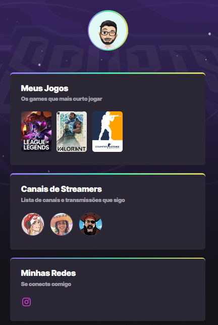

## NLW Explorer
### Participação do evento no ano de 2022

:notebook: ## __Projeto construído no evento NLW eSports - Tilha Explorer, 2022.__

*O Objeivo deste projeto é desenvolver um site com Games e Streamers favoritos, finalizando com alguns contatos pessoais.
Trabalhamos todo o layout baseado em Figma disponibilizado no evento e utilizamos diversas ferramentas, desde links externos na estrutura HTML até animações em CSS*.

__Confira o resultado:__ [Acesse Aqui](./index.html)

## Tecnologias Desenvolvidas

- HTML
- CSS 
- Git e GitHub

## Contato

&nbsp; &nbsp; &nbsp;
